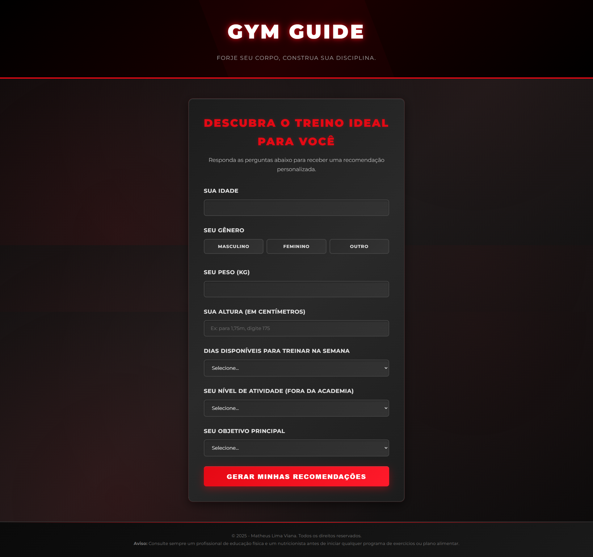

# Meu Portfólio | Matheus Viana



##  Sobre

Este é o meu portfólio pessoal, desenvolvido para apresentar minhas habilidades, projetos e experiências na área de tecnologia. O projeto foi criado com o objetivo de ser um espaço centralizado para demonstrar meu trabalho e minha jornada como desenvolvedor.

##  Demonstração

Você pode acessar a versão ao vivo do projeto através do link:
[https://matheuslviana29.github.io/Meu-Portfolio/](https://matheuslviana29.github.io/Meu-Portfolio/)

##  Funcionalidades

-   **Página Única (Single Page):** Navegação fluida entre as seções sem recarregar a página.
-   **Animação de Digitação:** Efeito dinâmico no título principal para destacar minhas áreas de atuação.
-   **Design Responsivo:** Totalmente adaptável para diferentes tamanhos de tela, como desktops, tablets e celulares.
-   **Seções Detalhadas:**
    -   **Home:** Uma introdução sobre mim.
    -   **Habilidades:** Ícones e descrições das tecnologias que domino.
    -   **Projetos:** Cards com informações, links para o código e demonstração dos meus principais projetos.
    -   **Experiências e Formação:** Uma linha do tempo com minha trajetória profissional e acadêmica.
    -   **Contato:** Formulário para envio de mensagens e links para minhas redes sociais.
-   **Formulário de Contato Funcional:** Envio de mensagens de forma assíncrona, com feedback visual para o usuário.

##  Tecnologias Utilizadas

O projeto foi desenvolvido utilizando as seguintes tecnologias:

-   **HTML5:** Para a estrutura semântica do conteúdo.
-   **CSS3:** Para a estilização, layout e responsividade.
-   **JavaScript:** Para a interatividade e funcionalidades dinâmicas.
-   **Boxicons:** Para os ícones utilizados no projeto.
-   **Typed.js:** Para a animação de digitação na seção "Home".

##  Como executar o projeto

Como este é um projeto front-end estático, você pode executá-lo facilmente seguindo os passos abaixo:

```bash
# 1. Clone este repositório
$ git clone [https://github.com/matheuslviana29/meu-portfolio.git](https://github.com/matheuslviana29/meu-portfolio.git)

# 2. Acesse a pasta do projeto no seu terminal
$ cd meu-portfolio

# 3. Abra o arquivo index.html no seu navegador de preferência.
